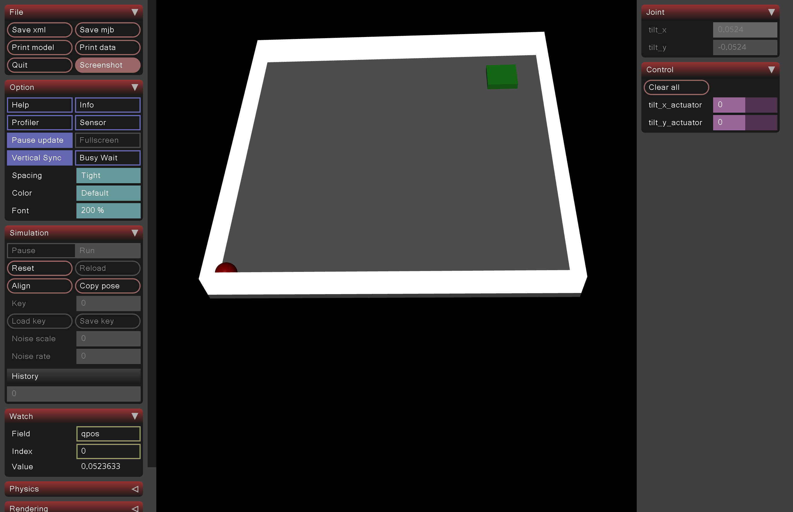
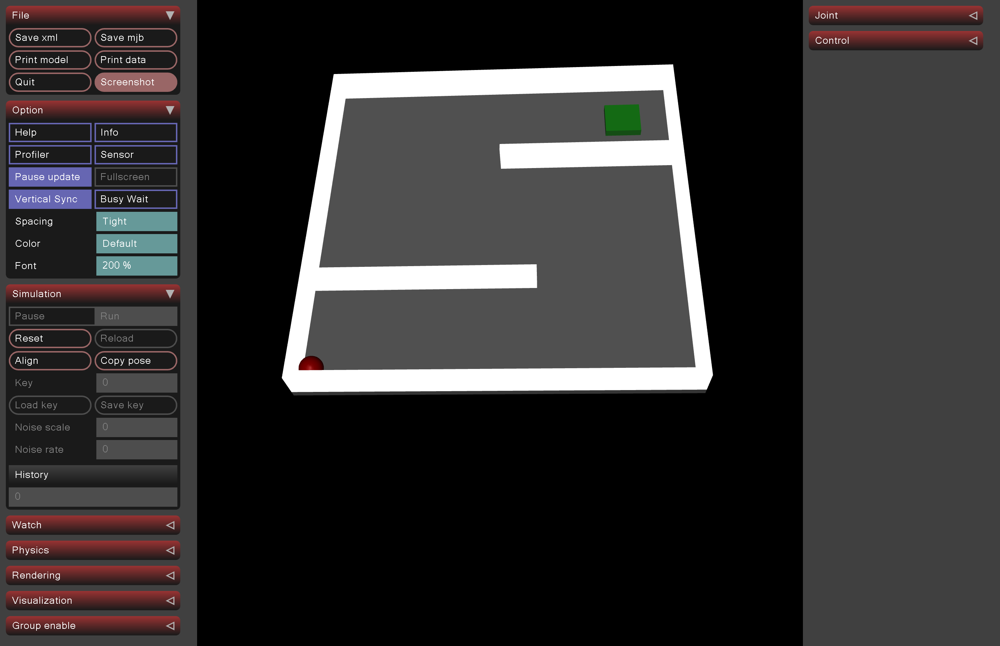
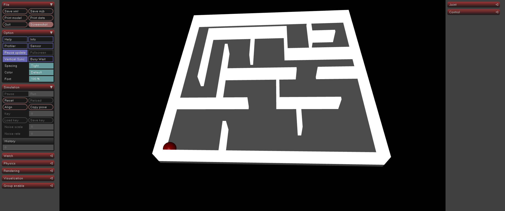

# The Lab - Labyrinth

# RL Project Launcher

## Setup (via DevContainer)
To set up the development environment using DevContainers, ensure you have the following configuration in your `.devcontainer/devcontainer.json` file:

```json
{
  "name": "The_LAB_P3.11",
  "image": "mcr.microsoft.com/devcontainers/python:3.11",
  "postCreateCommand": "apt update && apt install -y libsdl2-dev libosmesa6 && pip install --upgrade pip && pip install -r requirements.txt",
  "remoteUser": "root",
  "containerEnv": {
    "MUJOCO_GL": "osmesa",
    "DISPLAY": ":0"
  }
}
```

### Steps to Set Up
1. Install [Docker](https://www.docker.com/) and ensure it is running.
2. Install [VS Code](https://code.visualstudio.com/) and the [Remote - Containers](https://marketplace.visualstudio.com/items?itemName=ms-vscode-remote.remote-containers) extension.
3. Clone this repository and open the project in VS Code.
4. Copy or create your own .env file. (see .env.example)
5. When prompted, reopen the project inside the DevContainer.
6. Wait for dependencies to install.

---

## RL Project Launcher
This script serves as an entry point to launch different reinforcement learning (RL) projects and their actions.

### Features
- Select an RL project (currently supports `mujoco_plane`, `mujoco_simple_maze`, `mujoco_complex_maze`).
- Choose an action (`train`, `evaluate`, or `view`).
- Optionally specify an RL algorithm (e.g., SAC, PPO). This depends on the RL project. See below.
- Optionally specify an environment variant. This depends on the RL project. See below.
- Dynamically imports the selected RL module and executes the corresponding function.
- Loads configuration from an `.env` file.

### Usage
#### Running the Launcher
Execute the script using:
```sh
python main.py --project <project> --action <action> --model-name <model_name> [--algorithm <algorithm>] [--environment <environment>]
python main.py -p <project> -a <action> -mn <model_name> [-alg <algorithm>] [-env <environment>]
```

#### Available Options
| Argument               | Values                                                                                                                                      | Description                                               |
|------------------------|---------------------------------------------------------------------------------------------------------------------------------------------|-----------------------------------------------------------|
| `-p`,`--project`       | `mujoco_plane`, `mujoco_simple_maze`, `mujoco_complex_maze`                                                                                 | The RL project module to use.                             |
| `-a`,`--action`        | `train`, `evaluate`, `view`                                                                                                                 | The action to perform in the RL project.                  |
| `-mn`,`--model-name`   | Model name (required for train and evaluate)                                                                                                | The name of the model to use.                             |
| `-alg`,`--algorithm`   | `SAC`, `PPO`                                                                                                                                | The RL algorithm to use. Required in mujoco_complex_maze. |
| `-env`,`--environment` | `intermediate_rewards`, `no_intermediate_rewards`, `no_intermediate_rewards_with_time_penalty`, `no_intermediate_rewards_with_velocity_obs` | The env variant to use. Required in mujoco_complex_maze.  |


### Example Commands
- **Training**:
  ```sh
  python main.py --project mujoco_plane --action train --model-name my_model
  ```
  ```sh
  python main.py --project mujoco_complex_maze --action train --model-name my_model --algorithm SAC --environment intermediate_rewards
  ```
- **Evaluation**:
  ```sh
  python main.py --project mujoco_plane --action evaluate --model-name my_model
  ```
- **Visualization**:
  ```sh
  python main.py --project mujoco_plane --action view
  ```

### Visualisation

When running this project inside a DevContainer, visualization is not possible due to the lack of GUI support and X11 forwarding. To view the environment, you will need to run the script locally instead. 

Additionally, for macOS users, Mujoco visualization requires specific dependencies, and the script must be executed using mjpython instead of python. ([Mujoco Docs](https://mujoco.readthedocs.io/en/stable/python.html#passive-viewer))

---

## Requirements
Make sure you have the necessary dependencies installed. Install them using:
```sh
pip install -r requirements.txt
```
This will be automatically done when running inside a devContainer.

---

## Projects

### Mujoco Plane


### Mujoco Simple Maze


### Mujoco Complex Maze
